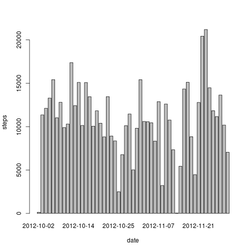
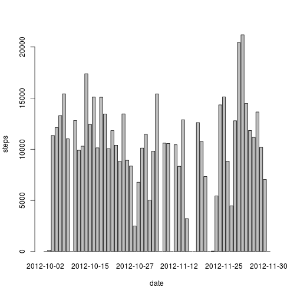

# Reproducible Research: Peer Assessment 1


## Loading and preprocessing the data

```r
unzip("activity.zip");
data<-read.csv("activity.csv");
cleanedData<-data[!is.na(data$steps),]
```

## What is mean total number of steps taken per day?
1.Make a histogram of the total number of steps taken each day

```r
df1<-tapply(cleanedData$steps,cleanedData$date,sum);
df1<-df1[!is.na(df1)];
barplot(df1,names.arg=unique(cleanedData$date),xlab="date",ylab="steps");
```

 

2.Calculate and report the mean and median total number of steps taken per day

```r
mean(df1)
```

```
## [1] 10766
```

```r
median(df1)
```

```
## [1] 10765
```

## What is the average daily activity pattern?
1.Make a time series plot (i.e. type = "l") of the 5-minute interval (x-axis) and the average number of steps taken, averaged across all days (y-axis)


```r
 df2<-tapply(cleanedData$steps,cleanedData$interval,mean);
 plot(unique(cleanedData$interval),df2,type='l',xlab='Intervals',ylab='steps',xaxt='n');
axis(1, labels = c('0:00', '5:00', '10:00', '15:00', '20:00'), at = c(0, 500, 1000, 1500, 2000));
```

 
2.Which 5-minute interval, on average across all the days in the dataset,contains the maximum number of steps?

```r
unique(cleanedData$interval[which.max(df2)]);
```

```
## [1] 835
```

## Imputing missing values
1. Calculate and report the total number of missing values in the dataset (i.e. the total number of rows with NAs)

```r
sum(is.na(data));
```

```
## [1] 2304
```

2. Devise a strategy for filling in all of the missing values in the dataset. The strategy does not need to be sophisticated. For example, you could use the mean/median for that day, or the mean for that 5-minute interval, etc.

filling the missing values with the mean of total steps taken that day.

```r
df3<-data[is.na(data$steps),];
meandata<-tapply(cleanedData$steps,cleanedData$date,mean);
meandata[is.na(meandata)]=0;
for(i in 1:nrow(df3)){df3$steps[i]=meandata[df3$date[i]]};
newdata<-rbind(cleanedData,df3);
```

3.Make a histogram of the total number of steps taken each day and Calculate and report the mean and median total number of steps taken per day. Do these values differ from the estimates from the first part of the assignment? What is the impact of imputing missing data on the estimates of the total daily number of steps?


```r
df4<-tapply(newdata$steps,newdata$date,sum);
barplot(df4,names.arg=unique(newdata$date),xlab="date",ylab="steps");
```

 

Mean and Median


```r
mean(df4);
```

```
## [1] 9354
```

```r
median(df4);
```

```
## [1] 10395
```
The mean and median of the new dataset differ from the original dataset. Thus it has a good impact on the dataset and provide more accurate range of values.

## Are there differences in activity patterns between weekdays and weekends?
factors

```r
newdata$date<-as.POSIXlt(newdata$date)$wday%%6;
for(i in 1:nrow(newdata)){if(newdata$date[i]==0) newdata$date[i]="weekends" else newdata$date[i]="weekdays" };
```
Plotting the data

```r
data1<-newdata[newdata$date=="weekdays",];
data2<-newdata[newdata$date=="weekends",];
par(mfrow=c(2,1));
plot(unique(data1$interval),tapply(data1$steps,data1$interval,mean),type='l',main="weekdays",xlab="interval",ylab="steps");
plot(unique(data2$interval),tapply(data2$steps,data2$interval,mean),type='l',main="weekends",xlab="interval",ylab="steps");
```

 
